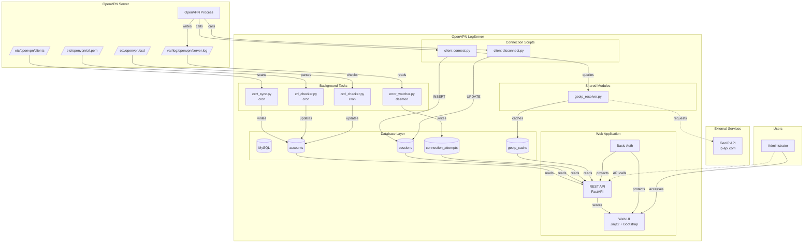
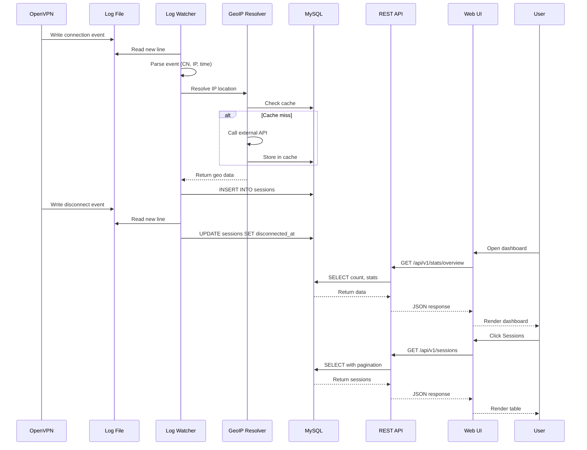
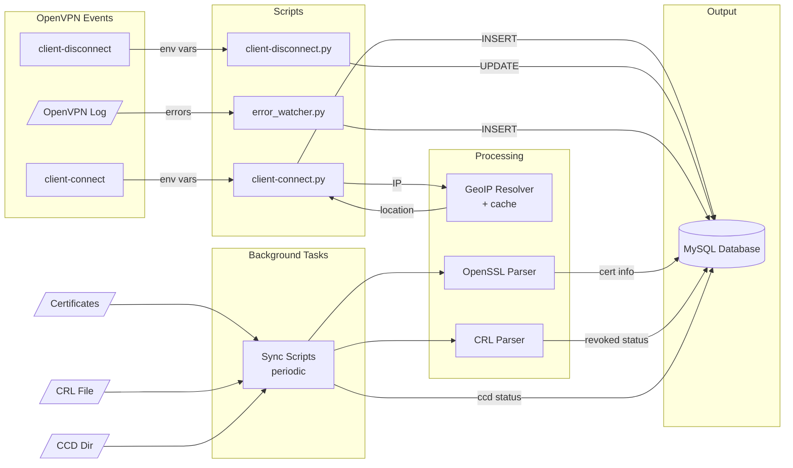
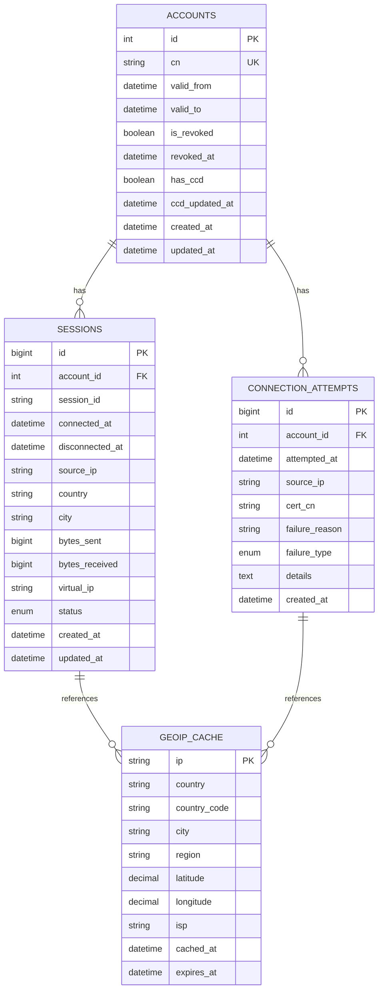
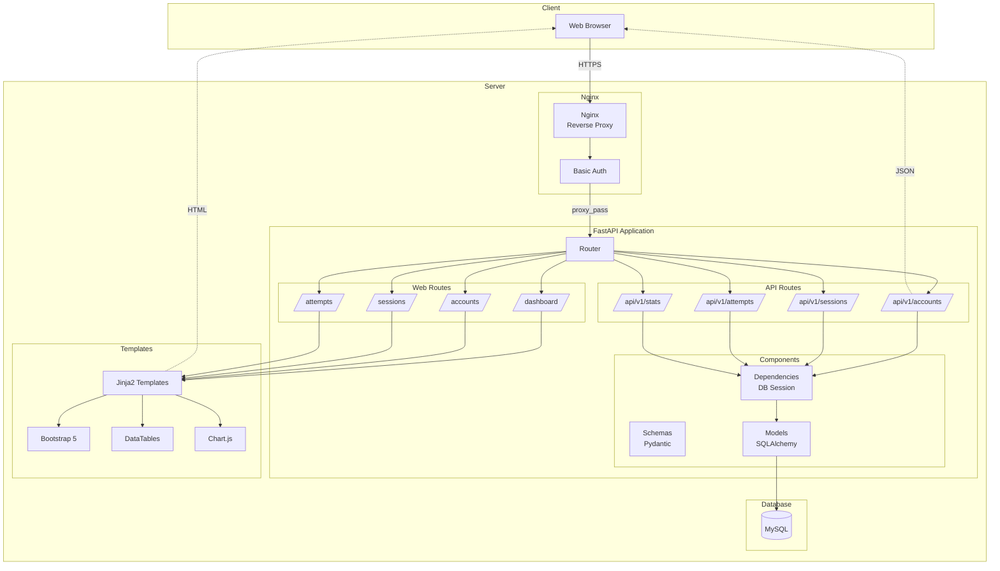
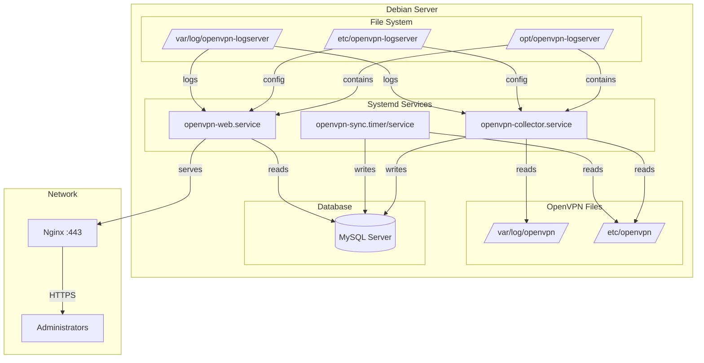
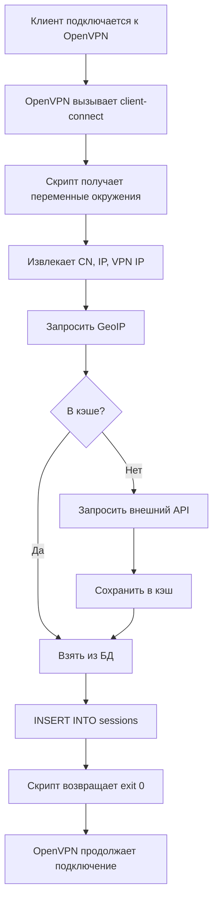
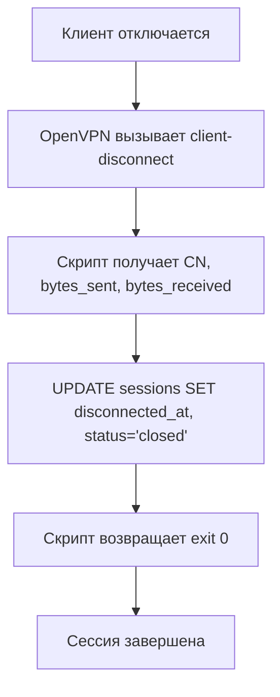

# Архитектурная диаграмма системы

## Общая архитектура

## Поток данных

## Компоненты Data Collector

## Структура базы данных

## Web Application Architecture

## Deployment Architecture

## Процесс обработки события подключения

## Процесс обработки отключения

